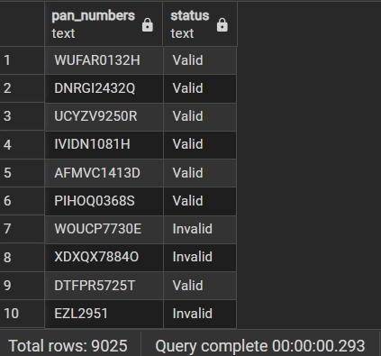

# 🪪 PAN Number Validation Project (PostgreSQL)

This project is a **PAN Card Number Validation System** built using **PostgreSQL**.  
The goal is to clean, preprocess, and validate **PAN numbers** of Indian nationals based on official rules and categorize them as **Valid** or **Invalid**.  
It was developed as part of a problem statement on **data cleaning and validation**.  

---

## 📌 Problem Statement
The project aims to:
- Clean and preprocess a dataset of PAN numbers.
- Validate PAN numbers based on:
  - Proper **length** (10 characters).
  - **Format**: `AAAAA1234A`
    - First 5: Alphabets  
    - Next 4: Digits  
    - Last 1: Alphabet  
  - No **adjacent duplicates** in alphabets/digits.  
  - No **sequential series** (e.g., `ABCDE`, `1234`).  
- Categorize PANs as:
  - ✅ **Valid PAN**  
  - ❌ **Invalid PAN**  
- Generate a **summary report** of:
  - Total records processed  
  - Total valid PANs  
  - Total invalid PANs  
  - Total missing PANs  

---
## 🛠️ Prerequisites

- **Database**: PostgreSQL (recommended 13+)
- SQL client: `psql`, DBeaver, pgAdmin, or any PostgreSQL-compatible client.
- Dataset: CSV file containing PAN numbers.
---

## 🛠️ Tech Stack
- **Database**: PostgreSQL  
- **Language**: SQL (PL/pgSQL functions)  
- **Tools**: pgAdmin / psql  

---

## ⚙️ Steps Implemented

### 1. Data Cleaning
- Removed missing values  
- Removed duplicates  
- Trimmed leading/trailing spaces  
- Converted all PANs to **uppercase**  

### 2. PAN Format Validation
- ✅ Function to check **adjacent characters**  
- ✅ Function to check **sequential characters**  
- ✅ Regex validation: `'^[A-Z]{5}[0-9]{4}[A-Z]$'`

### 3. Categorisation
- Classified PAN numbers as **Valid** or **Invalid**  
- Created a **view** `pan_status_identification` for results

## Output 

  

### 4. Summary Report
- Total records processed  
- Valid PAN count  
- Invalid PAN count  
- Missing PAN count
## Output

---

